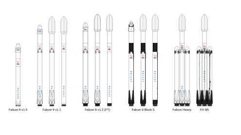
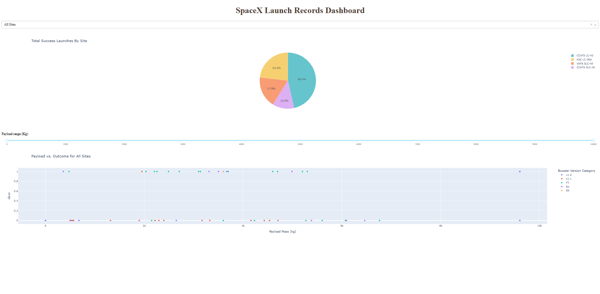

# SpaceX Rocket Launch Record Analysis (IBM Data Science Professional Capstone)

## Introduction

In this capstone project, we analyze data from the launch records of rockets built by SpaceX. SpaceX is known for its first-stage Falcon 9 rocket that can return to Earth after launching into orbit. As data scientists, we were tasked with predicting the success of upcoming SpaceX rocket landings and identifying which rocket model has the most successful landings. This capstone project involves tasks such as data collection and wrangling, exploratory data analysis (EDA), interactive dashboard creation, and predictive analysis, provided by IBM through Coursera. 

---

## [Data Collection](https://github.com/ColtonMatth/Capstone_IBM_Data_Science_Professional/blob/main/Data%20Collection%20and%20Data%20Wrangling/jupyter-labs-webscraping.ipynb)
The first task as a data scientist is to collect data. We gathered data by web scraping from the [SpaceX Falcon 9 and Falcon Heavy Launch Wikipedia](https://en.wikipedia.org/w/index.php?title=List_of_Falcon_9_and_Falcon_Heavy_launches&oldid=1027686922) pages to capture the tables from the website. By inspecting the website and reading the HTML file, we identified the `table` elements and headers `<th>`, which we then converted into a DataFrame. Once we had the DataFrame, we saved it as a [CSV file (spacex_web_scrapped.csv)](https://github.com/ColtonMatth/Capstone_IBM_Data_Science_Professional/blob/main/Data%20Collection%20and%20Data%20Wrangling/jupyter-labs-webscraping.ipynb). 

---

## [Data Wrangling](https://github.com/ColtonMatth/Capstone_IBM_Data_Science_Professional/blob/main/Data%20Collection%20and%20Data%20Wrangling/labs-jupyter-spacex-Data%20wrangling.ipynb)

Next, we worked on data wrangling. We examined the data types and the total missing values in each column of our DataFrame to handle those missing values. We counted each launch site, orbit type, and landing outcome relevant to our analysis. After identifying the different outcomes, we created a predictor column called 'Class,' where 0 represents an unsuccessful outcome and 1 represents a successful outcome. After data wrangling, we updated our DataFrame and saved it as a [CSV file (dataset_part_2.csv)](https://github.com/ColtonMatth/Capstone_IBM_Data_Science_Professional/blob/main/Data%20Collection%20and%20Data%20Wrangling/dataset_part_2.csv).

---

## [Exploratory Data Analysis (EDA)](https://github.com/ColtonMatth/Capstone_IBM_Data_Science_Professional/blob/main/Data%20Exploratory%20Analysis/edadataviz.ipynb)

In our exploratory data analysis, we created various data visualizations to compare attributes impacting the successful landing of the Falcon-9 rocket. We plotted scatter plots to show how two different attributes could affect the outcome of a successful landing, with each point colored either orange or blue. The attributes included 'Flight Numbers,' 'Launch Sites,' 'Payload Mass,' and 'Orbit,' with 'Class' as the hue for data points. We also created a bar chart to show the success rate ('Class') for each type of orbit and a line chart for time-series analysis of the success rate over time. After the EDA, we performed feature engineering on our DataFrame. We applied OneHotEncoder to the categorical variables in our feature DataFrame and converted numeric values to float64. Finally, we saved our feature DataFrame as a [CSV file (dataset_part_3.csv)](https://github.com/ColtonMatth/Capstone_IBM_Data_Science_Professional/blob/main/Data%20Exploratory%20Analysis/dataset_part_3.csv).

---

## [ EDA SQL in Python](https://github.com/ColtonMatth/Capstone_IBM_Data_Science_Professional/blob/main/Data%20Exploratory%20Analysis/jupyter-labs-eda-sql-coursera_sqllite.ipynb)

The second part of the EDA involved writing SQL queries in Python using Jupyter Notebook. We imported our CSV file into a DataFrame and converted it into a SQL table called SPACEXTABLE to write queries for our analysis. We wrote a query to show distinct LaunchSites from our data, revealing four different launch sites. Another query displayed five records where launch sites began with 'CCA' using a wildcard LIKE. We also wrote a query to display the total payload mass carried by the boosters launched by NASA (CRS) and find the average payload mass carried by the booster version F9 v1.1. We displayed the dates of the first successful landings and more queries for our analysis.

---

## [Folium: Launch Site Location](https://github.com/ColtonMatth/Capstone_IBM_Data_Science_Professional/blob/main/Interactive%20Visual%20Analytics%20and%20Dashboard/lab_jupyter_launch_site_location.ipynb)

In this task, we created an interactive map in Python using the Folium library. Similar to OpenStreetMap and Google Maps, Folium allowed us to import data containing latitude and longitude coordinates and cluster locations with the same coordinates. We added features to show the mouse position with coordinates when hovering over the map and calculate distances between launch sites and coastlines, railroads, roads, etc.

---

## [Plotly Interactive Dashboard](https://github.com/ColtonMatth/Capstone_IBM_Data_Science_Professional/blob/main/Interactive%20Visual%20Analytics%20and%20Dashboard/spacex_dash_app.py)

We created our interactive dashboard using the Plotly library in Python. The dashboard included two visualizations: a pie chart and a scatter plot. The pie chart had a dropdown to show launch sites, and the scatter plot had a slider bar for the payload mass (kg) range. The pie chart displayed the ratio of successful landings for each landing, and selecting a launch site showed the ratio of successful and unsuccessful landings. The scatter plot showed the range of payload mass (kg) to the class, indicating successful landings as 1 and unsuccessful landings as 0, with hue representing each launch site. Selecting a launch site showed the payload mass range to the class outcome. 

---

## [Predictive Analysis](https://github.com/ColtonMatth/Capstone_IBM_Data_Science_Professional/blob/main/Predictive%20Analysis/SpaceX_Machine%20Learning%20Prediction_Part_5.ipynb)

The final part of our task was predictive analysis of the rocket's successful landing. To address the question of whether the rocket will land successfully, we determined the appropriate machine learning technique for predicting this outcome. This problem is considered a classification problem since our predictor variable is categorical or binary (1 for successful landing, 0 for unsuccessful landing). We split the data into training and test sets to create our models.

We used the following classification algorithms for predictive analysis:
* Logistic Regression
* Support Vector Machine (SVM)
* Decision Tree
* K-Nearest Neighbor

After creating our models, we evaluated them using the accuracy score method with our test data and displayed confusion matrices to determine the best fit model for our predictive analysis.

---

## Results

In this capstone project, we aimed to identify which launch site has the highest success rate for the Falcon-9 rocket and predict the success of upcoming launches. Our findings revealed that the best launch site was CCAFS LC-40, with a success rate of 73.1%, while the other launch sites had a combined success rate of 46.4%. The time-series analysis showed an increasing success rate over time, indicating a higher chance of successful landings. For predictive analysis, we found that three models—logistic regression, support vector machine (SVM), and k-nearest neighbor—had the same accuracy score of 83.34% and identical confusion matrices. The decision tree model had the lowest accuracy score of 72.22%.

---

## Experience

In my experience, I enjoyed working on this capstone project, despite encountering some technical difficulties. There were instances where the Jupyter Notebook kernel died or became corrupted when computing large datasets. In predictive analysis, I encountered an issue with the SVM running infinitely due to a preprocessing syntax error where X was not assigned to the transform and fit of X, which solved the problem. After completing the predictive analysis, I was skeptical that three models had the same accuracy score and confusion matrix, suggesting the need for re-evaluation or using a different method to evaluate beyond accuracy scores.